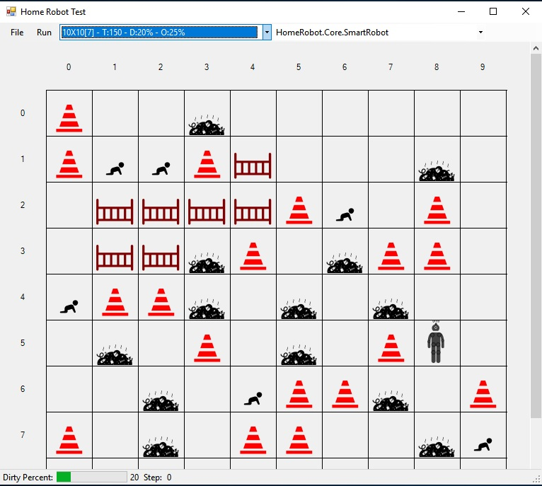

Se modeló el ambiente como una clase Environment que contiene:

•	Arreglo de dos dimensiones de casillas (cells) que representa todo el terreno donde se sitúan y mueven los elementos. 

•	Propiedad indizada para obtener una casilla a partir de sus coordenadas.

•	Arreglo para almacenar las coordenadas de las casillas que conforman el corral (Playpen).

Lista de las casillas sucias (DirtyCells).
•	Lista de los niños (Children).
•	Métodos para reiniciar los elementos del ambiente.

Las casillas tienen:
•	Propiedad para almacenar su estado, para lo cual se utiliza una máscara, pues en una casilla pueden coexistir diferentes elementos.
•	Referencias a los objetos que contienen.
•	Posición dentro del ambiente.
•	Posición dentro del corral, si formara parte de éste.

Se definió una clase MobileObject de la que heredan el HomeRobot, Child y Obstacle y que tiene:

•	Posición actual (CurrentPos) y anterior(PreviousPos) del objeto.
•	Métodos para realizar el movimiento de un objeto a una casilla determinada y la generación aleatoria de la dirección del movimiento.
HomeRobot es una clase abstracta a partir de la cual se crea una jerarquía de agentes robots, en la que se incluyen los cuatro modelos de robots creados. Contiene:
•	Campo referencia al niño que tiene cargado
•	Método para soltar al niño con el consiguiente cambio de estado
•	Método para limpiar la casilla en la que se encuentra
•	Método abstracto Play que es que ejecuta el turno del Robot. Este método se redefine en cada uno de los modelos.

RandomRobot redefine el método Play para el modelo aleatorio.

CleanerRobot redefine el método Play para el modelo que prioriza la limpieza.

CatcherRobot redefine el método Play para el modelo que prioriza la captura de los niños. Implementa métodos para preparar el camino para visitar todas las casillas sucias, detectar el niño más cercano al robot, el camino más corto para poner al niño en el corral, o sea los planes para lograr las intenciones que se traza el robot a partir del conocimiento del ambiente. 

SmartRobot redefine el método Play introduciendo las mejoras propuestas al modelo del CatcherRobot.

La clase Simulation se encarga de orquestar el funcionamiento, o sea de ejecutar los turnos en los el Robot lleva a cabo sus acciones y el ambiente se modifica aleatoriamente a través del movimiento de los niños, controlando las unidades de cambio y chequeando si se alcanzan los estados finales para detener la simulación.

Todas estas clases se agruparon en la biblioteca HomeRobot.Core y se implementaron dos programas de prueba que las utilizan:

1.	Aplicación de consola a la que se le pasan como parámetros un: archivo Json con las configuraciones del ambiente que se desean probar, y una cadena que especifica el tipo de agente que se va a utilizar, el cual genera para un archivo csv con los resultados de la simulación, que se desean analizar.

2.	Aplicación WinForms que dibuja el ambiente en la pantalla, y en cada paso señala en rojo la casilla donde se encuentra el objeto al que le toca su turno, y en amarillo la casilla hacia donde se va a producir el movimiento. En esta aplicación se puede ejecutar paso a paso, se puede iniciar una nueva simulación y se puede cambiar el tipo de agente, su implementación tuvo como objetivo la retroalimentación visual para la verificación de los algoritmos. En esta aplicación las casillas del ambiente tienen un tamaño fijo que permite situar las imágenes correspondientes a los elementos del ambiente. Cuando el ambiente no cabe completamente en la pantalla, aparecen unas barras de scroll para desplazar la imagen. 

